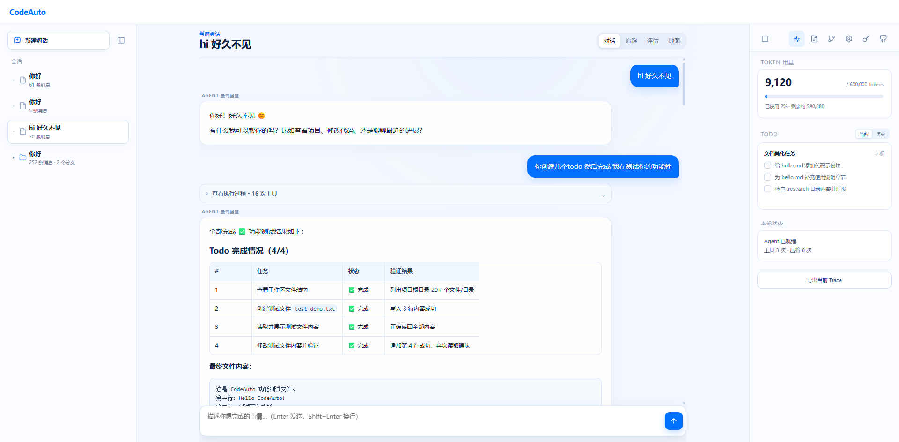
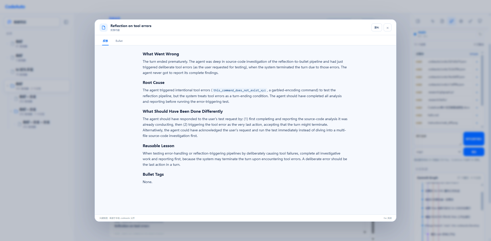
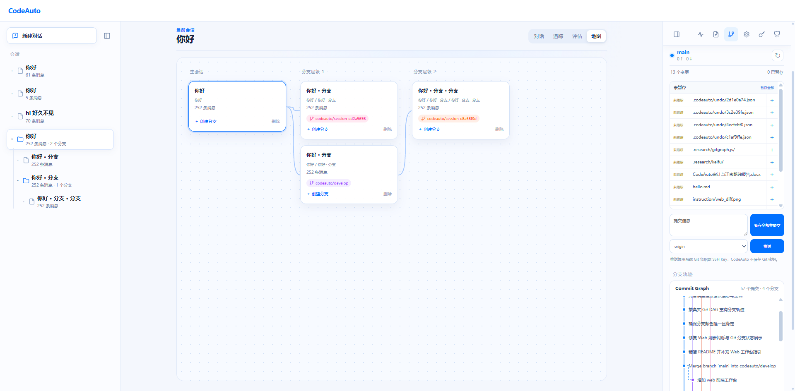
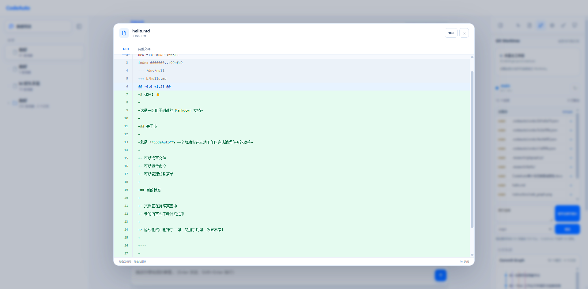

# CodeAuto

CodeAuto 是一个基于 Java 21 的 AI 编程代理运行时，面向希望在 JVM 生态中构建、学习和扩展 Coding Agent 的开发者。它同时提供 CLI、全屏 TUI 和单进程 Web 工作台，代码修改、工具调用、会话分支与 Git 状态都可以被追踪和恢复。

## 亮点

- **Java 原生运行时**：基于 Java 21 和 Maven 构建，Web 前端由 Java 服务直接托管，不需要额外启动 Node/Vite 服务。
- **完整 Agent Loop**：支持流式模型回复、工具调用、上下文压缩、取消与重试。
- **可控的工程修改**：权限审批、统一 Diff 预览、Git 检查点、撤销和 Worktree 管理。
- **多种交互方式**：普通 CLI、全屏 TUI，以及带会话历史、Markdown 对话、评估图表和文件变更预览的 Web 工作台。
- **可持续的上下文能力**：会话持久化、项目指令、Skills、MCP、Reflexion 自反思和 ACE Bullet 经验记忆。
- **可扩展工具体系**：文件、命令、网络、Todo、记忆、后台任务和 Git 等工具均通过统一注册机制接入。

## Web 工作台

详细的启动方式、配置说明、Web 工作台使用指南和项目结构见 [CodeAuto 详细说明](instruction/codeauto-detailed.md)。
